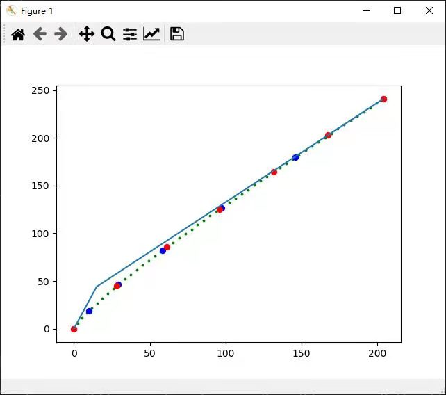
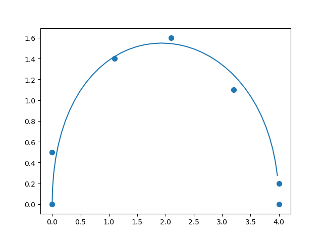

等长贝塞尔曲线的C++实现
=========
## 简略说明
在本次的内容中实现了等长的贝塞尔曲线和贝塞尔曲线的拟合方式，主要是以C++的形式进行。
在本仓库中中实现了三个工具类和一个属性类：
### 属性类
>属性类为
```
struct Point{
    double x;
    double y;
}
```
### 工具类
```BezierCurve``` \
```Bezier_smoothL3```

作用：\
 ```BezierCurve``` \
 用于拟合多阶贝塞尔曲线，输入是```vector<Point>``` \
 使用函数有
 > ```double total_length()``` \
 此函数主要是获得多阶贝塞尔曲线的整体的长度 

 > ```vector<Point> get_arg_points(int k, double iter_eps = 1e-5)``` \
 在贝塞尔曲线的起始点和终点之间插入k个点，让整体的贝塞尔曲线分为（k+1）段等长的曲线 

 > ```vector<Point> get_points(int k)``` \
 根据t的等长度选择中间的k个点

 ```Bezier_smoothL3```  \
 用于贝塞尔曲线的平滑。不需要输入，主要是为工具类。
 
 使用的函数有：

 > ```vector<Point> fit_curve(vector<Point>& pts, const double& maxE)```    \
 作用为拟合```pts```所表达的曲线离散点，而且所产生的贝塞尔曲线距离每个点的最大距离不超过```maxE```，返回的内容为贝塞尔曲线的控制点，因为这个为三阶贝塞尔曲线的拟合，整体的拟合为```4k```

## 测试结果：

### 贝塞尔曲线等长结果


### 平滑结果
